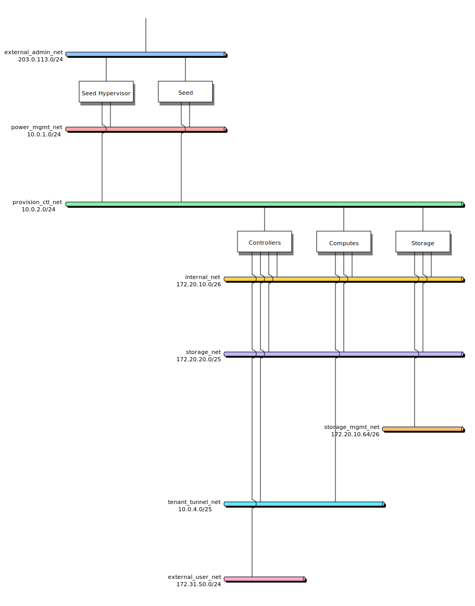

===========================================================================
Real-World Bridges and Bonds Configuration: A virtualised case study
===========================================================================

This section details a real-world configuration to illustrate how to configure
bonds and bridges using Kayobe. The deployment runs
virtualised compute workloads with no bare metal resources managed through
Ironic.

This scenario walks through configuring host networking for each host group,
starting from a known network topology.

Network Topology
================

The following diagram shows how networks are mapped to each of the hosts groups.

   Network assignment to host groups

..
   Original nwdiag source used to generate the SVG above:

   nwdiag {
      // Node labels keep names concise while preserving readable host group
      // names in the rendered diagram.
      seed_hv [label = "Seed Hypervisor"];
      seed [label = "Seed"];
      controllers [label = "Controllers"];
      computes [label = "Computes"];
      storage [label = "Storage"];

      network external_admin_net {
         address = "203.0.113.0/24";
         color = "#93c5fd";
         seed_hv;
         seed;
      }

      network power_mgmt_net {
         address = "10.0.1.0/24";
         color = "#fca5a5";
         seed_hv;
         seed;
      }

      network provision_ctl_net {
         address = "10.0.2.0/24";
         color = "#86efac";
         seed_hv;
         seed;
         controllers;
         computes;
         storage;
      }

      network internal_net {
         address = "172.20.10.0/26";
         color = "#fcd34d";
         controllers;
         computes;
         storage;
      }

      network storage_net {
         address = "172.20.20.0/25";
         color = "#c4b5fd";
         controllers;
         computes;
         storage;
      }

      network storage_mgmt_net {
         address = "172.20.10.64/26";
         color = "#fdba74";
         storage;
      }

      network tenant_tunnel_net {
         address = "10.0.4.0/25";
         color = "#67e8f9";
         controllers;
         computes;
      }

      network external_user_net {
         address = "172.31.50.0/24";
         color = "#f9a8d4";
         controllers;
      }
   }

.. |color_sky_blue| raw:: html

   sky blue

.. |color_rose| raw:: html

   rose

.. |color_green| raw:: html

   green

.. |color_amber| raw:: html

   amber

.. |color_violet| raw:: html

   violet

.. |color_orange| raw:: html

   orange

.. |color_cyan| raw:: html

   cyan

.. |color_pink| raw:: html

   pink

.. note::

   It is important to use non-routable (RFC 1918 private) address ranges for the
   power management and provisioning/control networks. This prevents accidental
   exposure of the infrastructure management and provisioning interfaces to
   external networks, limiting access to authorized internal networks only.

.. list-table:: VLAN key and colour groups
   :header-rows: 1

   * - Network
     - VLAN
     - Group
   * - external_admin_net
     - 2270
     - Admin/management (|color_sky_blue|)
   * - power_mgmt_net
     - 2802
     - Power management (|color_rose|)
   * - provision_ctl_net
     - 3
     - Provision/control (|color_green|)
   * - internal_net
     - 4
     - Internal API (|color_amber|)
   * - storage_net
     - 5
     - Storage (|color_violet|)
   * - storage_mgmt_net
     - 6
     - Storage management (|color_orange|)
   * - tenant_tunnel_net
     - 7
     - Tenant tunnel (|color_cyan|)
   * - external_user_net
     - 2280
     - Public API (|color_pink|)

Define Networks in networks.yml
===============================

Kayobe uses well-known logical network role variables (such as
``provision_oc_net_name`` and ``tunnel_net_name``). These can optionally be
customised to give more descriptive names. The mappings are defined in
``etc/kayobe/networks.yml``.

.. code-block:: yaml
   :caption: ``etc/kayobe/networks.yml``

   ---
   # Kayobe network configuration.

   ###############################################################################
   # Network role to network name mappings.

   # Network used by the seed to manage bare metal overcloud hosts via their
   # out-of-band management controllers.
   oob_oc_net_name: "power_mgmt_net"

   # Network used by the seed to provision bare metal overcloud hosts.
   provision_oc_net_name: "provision_ctl_net"

   # Network used to expose the internal OpenStack API endpoints.
   internal_net_name: "internal_net"

   # Network used to expose the public OpenStack API endpoints.
   public_net_name: "external_user_net"

   # Network used by Neutron to carry tenant overlay network traffic.
   tunnel_net_name: "tenant_tunnel_net"

With the names established, populate the CIDRs, VLAN IDs, MTU values, and
allocation pools for each named network in ``etc/kayobe/environments/production/networks.yml``:

.. code-block:: yaml
   :caption: ``etc/kayobe/environments/production/networks.yml``

   ---
   # Kayobe network configuration.

   ###############################################################################
   # Network definitions.

   hs_bond_mtu: 9150

   # Power/Management network IP information.
   power_mgmt_net_cidr: "10.0.1.0/24"
   power_mgmt_net_allocation_pool_start: "10.0.1.10"
   power_mgmt_net_allocation_pool_end: "10.0.1.250"
   power_mgmt_net_vlan: 2802
   power_mgmt_net_mtu: 1500

   # Provisioning/Control network IP information.
   provision_ctl_net_cidr: "10.0.2.0/24"
   provision_ctl_net_allocation_pool_start: "10.0.2.10"
   provision_ctl_net_allocation_pool_end: "10.0.2.127"
   provision_ctl_net_inspection_allocation_pool_start: "10.0.2.128"
   provision_ctl_net_inspection_allocation_pool_end: "10.0.2.250"
   provision_ctl_net_switch_vlan: 3
   provision_ctl_net_mtu: 1500

   # Internal API network IP information.
   internal_net_vip_address: "172.20.10.2"
   internal_net_cidr: "172.20.10.0/26"
   internal_net_allocation_pool_start: "172.20.10.7"
   internal_net_allocation_pool_end: "172.20.10.62"
   internal_net_vlan: 4
   internal_net_mtu: 9000

   # Storage network IP information.
   storage_net_cidr: "172.20.20.0/25"
   storage_net_allocation_pool_start: "172.20.20.10"
   storage_net_allocation_pool_end: "172.20.20.126"
   storage_net_vlan: 5
   storage_net_mtu: "{{ hs_bond_mtu }}"

   # Storage Management network IP information.
   storage_mgmt_net_cidr: "172.20.10.64/26"
   storage_mgmt_net_allocation_pool_start: "172.20.10.74"
   storage_mgmt_net_allocation_pool_end: "172.20.10.124"
   storage_mgmt_net_vlan: 6
   storage_mgmt_net_mtu: 9000

   # Tenant/Tunnel network IP information.
   tenant_tunnel_net_cidr: "10.0.4.0/25"
   tenant_tunnel_net_allocation_pool_start: "10.0.4.10"
   tenant_tunnel_net_allocation_pool_end: "10.0.4.127"
   tenant_tunnel_net_vlan: 7
   tenant_tunnel_net_mtu: "{{ hs_bond_mtu }}"

   # External/Admin network IP information.
   # This network is used for management access.
   external_admin_net_cidr: "203.0.113.0/24"
   external_admin_net_allocation_pool_start: "203.0.113.5"
   external_admin_net_allocation_pool_end: "203.0.113.9"
   external_admin_net_vlan: 2270
   external_admin_net_mtu: 1500
   external_admin_net_gateway: "203.0.113.250"

   # External User network
   external_user_net_cidr: "172.31.50.0/24"
   external_user_net_vip_address: "172.31.50.4"
   external_user_net_gateway: "172.31.50.250"
   external_user_net_allocation_pool_start: "172.31.50.10"
   external_user_net_allocation_pool_end: "172.31.50.249"
   external_user_net_vlan: 2280
   external_user_net_mtu: 1500

   # FQDN address for public API endpoints, registered with the external DNS
   # server to resolve to the public VIP address.
   external_user_net_fqdn: "api.example.org"

   ###############################################################################
   # Dummy variable to allow Ansible to accept this file.
   workaround_ansible_issue_8743: yes

Common Configuration
====================

Shared overcloud interface mappings should be defined in
``inventory/group_vars/overcloud/network-interfaces``.
This common configuration is inherited by
all hosts in the overcloud group, including controllers, storage, and compute.

The aim is to avoid repetition of common configuration. You can still override
values for specific host groups where required.

.. code-block:: yaml
    :caption: ``inventory/group_vars/overcloud/network-interfaces``

    ---
    # High speed bond config
    hs_bond_interface: "bond0"
    hs_bond_bond_mode: "802.3ad"
    hs_bond_bond_xmit_hash_policy: "layer3+4"
    hs_bond_physical_network: "physnet2"

    # 25G Control bond config
    control_25g_interface: "bond1"
    control_25g_bond_mode: "802.3ad"
    control_25g_bond_xmit_hash_policy: "layer3+4"
    control_25g_physical_network: "physnet3"

    # Provision / Control maps to a bridge on the 25G bond port
    provision_ctl_net_interface: "br{{ control_25g_interface }}"
    provision_ctl_net_bridge_ports:
       - "{{ control_25g_interface }}"
    provision_ctl_net_physical_network: "physnet3"

    # List of names of networks used to provide external network access via Neutron.
    # This value is overridden for controllers to add the external_10g network.
    external_net_names:
       - "hs_bond"
       - "provision_ctl_net"

Seed Hypervisor
===============

.. warning::

   Network reconfiguration can potentially break networking and render hosts
   inaccessible. This is particularly risky when moving the admin interface
   onto a bridge or bond. It is recommended that you:

   - Add a password to a local user account that can be accessed via the BMC
     (either web UI or serial console) to recover should configuration fail.
     This password should be removed after successful initial deployment.

   - Configure one host per group initially before applying the configuration
     across the entire group. If a host becomes misconfigured, it can simply be
     reprovisioned.

.. graphviz::
   :caption: Seed hypervisor interface layering

   digraph seed_hypervisor_interfaces {
      rankdir=LR;
      nodesep=0.35;
      ranksep=0.6;
      fontname="Helvetica";
      node [shape=box, style="rounded,filled", color="#334155", fillcolor="#f8fafc", fontname="Helvetica", fontsize=10];
      edge [color="#475569", arrowsize=0.7, penwidth=1.1];

      sh_m1 [label="enp65s0f0np0", fillcolor="#e2e8f0"];
      sh_m2 [label="enp65s0f1np1", fillcolor="#e2e8f0"];
      sh_m3 [label="enp2s0f0np0", fillcolor="#e2e8f0"];
      sh_m4 [label="enp2s0f1np1", fillcolor="#e2e8f0"];

      sh_b0 [label="bond0", fillcolor="#dbeafe", color="#1d4ed8"];
      sh_b1 [label="bond1", fillcolor="#dbeafe", color="#1d4ed8"];

      sh_v_admin [label="bond0.2270", fillcolor="#fef3c7", color="#b45309"];
      sh_v_power [label="bond0.2802", fillcolor="#fef3c7", color="#b45309"];

      sh_br_admin [label="brbond0_admin", fillcolor="#dcfce7", color="#15803d"];
      sh_br_power [label="brbond0_power", fillcolor="#dcfce7", color="#15803d"];
      sh_br_ctl [label="brbond1", fillcolor="#dcfce7", color="#15803d"];

      sh_n_admin [label="external_admin_net", fillcolor="#fee2e2", color="#b91c1c"];
      sh_n_power [label="power_mgmt_net", fillcolor="#fee2e2", color="#b91c1c"];
      sh_n_ctl [label="provision_ctl_net", fillcolor="#fee2e2", color="#b91c1c"];

      sh_n_admin -> sh_br_admin -> sh_v_admin -> sh_b0;
      sh_n_power -> sh_br_power -> sh_v_power -> sh_b0;
      sh_n_ctl -> sh_br_ctl -> sh_b1;

      sh_b0 -> sh_m1;
      sh_b0 -> sh_m2;
      sh_b1 -> sh_m3;
      sh_b1 -> sh_m4;
   }

.. note::

   Any network interface that the seed VM needs to be connected to must be
   backed by a Linux bridge on the hypervisor. Kayobe provisions the seed using
   libvirt, which attaches virtual machine interfaces to host networks via
   bridges — a plain bond or VLAN sub-interface cannot be used directly.

In ``etc/kayobe/seed-hypervisor.yml`` define extra networks that are not
mapped to this host by default:

.. code-block:: yaml

   seed_hypervisor_extra_network_interfaces:
     - mgmt_bond_ext
     - mgmt_vlan_admin
     - mgmt_vlan_power
     - mgmt_bond_int
     - external_admin_net
     - power_mgmt_net

In ``inventory/group_vars/seed-hypervisor/network-interfaces`` define the
network interface mappings and properties.

To see which interface variables require definitions, run
``kayobe configuration dump --var-name network_interfaces --limit seed-hypervisor``.
Before creating this file, also run ``ip a`` on the seed
hypervisor and use the reported physical interface names in
``*_bond_slaves`` variables.

.. code-block:: yaml

   mgmt_bond_ext_interface: bond0
   mgmt_bond_ext_bond_mode: 802.3ad
   mgmt_bond_ext_bond_xmit_hash_policy: layer3+4
   mgmt_bond_ext_bond_slaves:
     - enp65s0f0np0
     - enp65s0f1np1

   mgmt_vlan_admin_interface: "{{ mgmt_bond_ext_interface }}.{{ external_admin_net_vlan }}"
   external_admin_net_interface: "br{{ mgmt_bond_ext_interface }}_admin"
   external_admin_net_bridge_ports:
     - "{{ mgmt_vlan_admin_interface }}"

   mgmt_vlan_power_interface: "{{ mgmt_bond_ext_interface }}.{{ power_mgmt_net_vlan }}"
   power_mgmt_net_interface: "br{{ mgmt_bond_ext_interface }}_power"
   power_mgmt_net_bridge_ports:
     - "{{ mgmt_vlan_power_interface }}"

   mgmt_bond_int_interface: bond1
   mgmt_bond_int_bond_mode: 802.3ad
   mgmt_bond_int_bond_xmit_hash_policy: layer3+4
   mgmt_bond_int_bond_slaves:
     - enp2s0f0np0
     - enp2s0f1np1

   provision_ctl_net_interface: "br{{ mgmt_bond_int_interface }}"
   provision_ctl_net_bridge_ports:
     - "{{ mgmt_bond_int_interface }}"

Seed
====

.. warning::

   Network reconfiguration can potentially break networking and render hosts
   inaccessible. This is particularly risky when moving the admin interface
   onto a bridge or bond. It is recommended that you:

   - Add a password to a local user account that can be accessed via the BMC
     (either web UI or serial console) to recover should configuration fail.
     This password should be removed after successful initial deployment.

   - Configure one host per group initially before applying the configuration
     across the entire group. If a host becomes misconfigured, it can simply be
     reprovisioned.

.. note::

   The seed's network interfaces must be defined before running
   ``kayobe seed host provision``. Provisioning creates the seed VM and
   attaches it to the bridges defined on the hypervisor, so the interface
   configuration must be in place for Kayobe to know which networks to connect.

   The interface order on the seed VM is derived from
   ``seed_hypervisor_libvirt_networks``. To inspect the resolved value, run:

   .. code-block:: console

      kayobe configuration dump --var-name seed_hypervisor_libvirt_networks --limit seed-hypervisor

The seed is configured to use a separate network card for each logical network.

.. graphviz::
   :caption: Seed host interface mapping

   digraph seed_host_interfaces {
      rankdir=LR;
      nodesep=0.6;
      ranksep=0.7;
      fontname="Helvetica";
      node [shape=box, style="rounded,filled", color="#334155", fillcolor="#f8fafc", fontname="Helvetica", fontsize=10];
      edge [color="#475569", arrowsize=0.7, penwidth=1.1];

      s_if2 [label="ens2", fillcolor="#e2e8f0"];
      s_if3 [label="ens3", fillcolor="#e2e8f0"];
      s_if4 [label="ens4", fillcolor="#e2e8f0"];

      s_n_admin [label="external_admin_net", fillcolor="#fee2e2", color="#b91c1c"];
      s_n_ctl [label="provision_ctl_net", fillcolor="#fee2e2", color="#b91c1c"];
      s_n_power [label="power_mgmt_net", fillcolor="#fee2e2", color="#b91c1c"];

      s_n_admin -> s_if2;
      s_n_ctl -> s_if3;
      s_n_power -> s_if4;
   }

In ``etc/kayobe/seed.yml`` define extra networks that are not mapped to this
host by default:

.. code-block:: yaml

   seed_extra_network_interfaces:
     - external_admin_net

In ``inventory/group_vars/seed/network-interfaces`` map networks directly to
host interfaces.

To see which interface variables require definitions, run
``kayobe configuration dump --var-name network_interfaces --limit seed``

.. code-block:: yaml

   external_admin_net_interface: ens2
   provision_ctl_net_interface: ens3
   power_mgmt_net_interface: ens4

Controllers
===========

.. warning::

   Network reconfiguration can potentially break networking and render hosts
   inaccessible. This is particularly risky when moving the admin interface
   onto a bridge or bond. It is recommended that you:

   - Add a password to a local user account that can be accessed via the BMC
     (either web UI or serial console) to recover should configuration fail.
     This password should be removed after successful initial deployment.

   - Configure one host per group initially before applying the configuration
     across the entire group. If a host becomes misconfigured, it can simply be
     reprovisioned.

The diagram below shows the network interface configuration for the
controllers:

Controllers use a combination of bond aggregation and Linux bridges.

.. graphviz::
   :caption: Controller interface layering

   digraph controller_interfaces {
      rankdir=LR;
      nodesep=0.35;
      ranksep=0.6;
      fontname="Helvetica";
      node [shape=box, style="rounded,filled", color="#334155", fillcolor="#f8fafc", fontname="Helvetica", fontsize=10];
      edge [color="#475569", arrowsize=0.7, penwidth=1.1];

      c_m1 [label="eno33np0", fillcolor="#e2e8f0"];
      c_m2 [label="eno34np1", fillcolor="#e2e8f0"];
      c_m3 [label="ens3f0np0", fillcolor="#e2e8f0"];
      c_m4 [label="ens3f1np1", fillcolor="#e2e8f0"];
      c_m5 [label="eno35np2", fillcolor="#e2e8f0"];
      c_m6 [label="eno36np3", fillcolor="#e2e8f0"];

      c_b1 [label="bond1", fillcolor="#dbeafe", color="#1d4ed8"];
      c_b0 [label="bond0", fillcolor="#dbeafe", color="#1d4ed8"];
      c_b2 [label="bond2", fillcolor="#dbeafe", color="#1d4ed8"];

      c_v_int [label="bond0.4", fillcolor="#fef3c7", color="#b45309"];
      c_v_sto [label="bond0.5", fillcolor="#fef3c7", color="#b45309"];
      c_v_tun [label="bond0.7", fillcolor="#fef3c7", color="#b45309"];
      c_v_ext [label="brbond2.2280", fillcolor="#fef3c7", color="#b45309"];

      c_br_ctl [label="brbond1", fillcolor="#dcfce7", color="#15803d"];
      c_br_ext [label="brbond2", fillcolor="#dcfce7", color="#15803d"];

      c_n_ctl [label="provision_ctl_net", fillcolor="#fee2e2", color="#b91c1c"];
      c_n_int [label="internal_net", fillcolor="#fee2e2", color="#b91c1c"];
      c_n_sto [label="storage_net", fillcolor="#fee2e2", color="#b91c1c"];
      c_n_tun [label="tenant_tunnel_net", fillcolor="#fee2e2", color="#b91c1c"];
      c_n_ext [label="external_user_net", fillcolor="#fee2e2", color="#b91c1c"];

      c_n_ctl -> c_br_ctl -> c_b1;
      c_n_int -> c_v_int -> c_b0;
      c_n_sto -> c_v_sto -> c_b0;
      c_n_tun -> c_v_tun -> c_b0;
      c_n_ext -> c_v_ext -> c_br_ext -> c_b2;

      c_b1 -> c_m1;
      c_b1 -> c_m2;
      c_b0 -> c_m3;
      c_b0 -> c_m4;
      c_b2 -> c_m5;
      c_b2 -> c_m6;
   }

Controllers integrate the physical bond interfaces with OpenStack Neutron to
provide tenant network connectivity.

.. graphviz::
   :caption: Wiring networks into Neutron (controllers)

   digraph neutron_wiring_controllers {
      rankdir=LR;
      nodesep=0.35;
      ranksep=0.7;
      fontname="Helvetica";
      node [shape=box, style="rounded,filled", color="#334155", fillcolor="#f8fafc", fontname="Helvetica", fontsize=10];
      edge [color="#475569", arrowsize=0.7, penwidth=1.1];

      { rank=same; c_net_ext; c_net_hs; c_net_ctl; }

      c_net_ext [label="external_bridge\nphysnet1\n(network maps to Linux bridge)", fillcolor="#fee2e2", color="#b91c1c"];
      c_net_hs [label="hs_bond\nphysnet2\n(network maps directly)", fillcolor="#fee2e2", color="#b91c1c"];
      c_net_ctl [label="provision_ctl_net\nphysnet3\n(network maps to Linux bridge)", fillcolor="#fee2e2", color="#b91c1c"];

      c_lx_ext [label="Linux bridge\nbrbond2", fillcolor="#dcfce7", color="#15803d"];
      c_lx_ctl [label="Linux bridge\nbrbond1", fillcolor="#dcfce7", color="#15803d"];
      c_bond0 [label="bond0", fillcolor="#fef3c7", color="#b45309"];

      c_ovs_ext [label="OVS bridge\nbrbond2-ovs", fillcolor="#dbeafe", color="#1d4ed8"];
      c_ovs_hs [label="OVS bridge\nbond0-ovs", fillcolor="#dbeafe", color="#1d4ed8"];
      c_ovs_ctl [label="OVS bridge\nbrbond1-ovs", fillcolor="#dbeafe", color="#1d4ed8"];
      c_neutron [label="Neutron\nprovider networks", fillcolor="#e0f2fe", color="#0284c7"];

      subgraph cluster_c_pp_brbond2 {
         label="patch link";
         style="dashed";
         color="#6d28d9";
         fillcolor="#faf5ff";
         c_pp_brbond2_phy [label="p-brbond2-phy", fillcolor="#ede9fe", color="#6d28d9"];
         c_pp_brbond2_ovs [label="p-brbond2-ovs", fillcolor="#ede9fe", color="#6d28d9"];
      }

      subgraph cluster_c_pp_brbond1 {
         label="patch link";
         style="dashed";
         color="#6d28d9";
         fillcolor="#faf5ff";
         c_pp_brbond1_phy [label="p-brbond1-phy", fillcolor="#ede9fe", color="#6d28d9"];
         c_pp_brbond1_ovs [label="p-brbond1-ovs", fillcolor="#ede9fe", color="#6d28d9"];
      }

      c_net_ext -> c_lx_ext;
      c_lx_ext -> c_pp_brbond2_phy;
      c_pp_brbond2_ovs -> c_ovs_ext;
      c_net_ctl -> c_lx_ctl;
      c_lx_ctl -> c_pp_brbond1_phy;
      c_pp_brbond1_ovs -> c_ovs_ctl;
      c_net_hs -> c_bond0;
      c_bond0 -> c_ovs_hs [label="direct interface"];

      c_ovs_ext -> c_neutron;
      c_ovs_hs -> c_neutron;
      c_ovs_ctl -> c_neutron;
   }

This diagram shows how host networks are wired into Neutron through Open
vSwitch bridges. When a network maps to a Linux bridge, that bridge connects to
OVS via a patch link. When a network does not map to a Linux bridge, it is
connected directly into the OVS bridge. Where possible, operators should
prefer wiring a bond directly into OVS, since this can enable hardware
offloading. Linux bridges are required when a service running on the host must
attach directly to that network.

Controllers usually combine bridge-on-bond for external/API traffic with VLAN
subinterfaces for API and tunnel networks.

In ``etc/kayobe/controllers.yml`` ensure the host network list includes the
expected external and control networks:

.. code-block:: yaml

   controller_network_interfaces: "{{ storage_network_interfaces + controller_extra_network_interfaces }}"

   controller_extra_network_interfaces:
     - external_10g
     - external_bridge
     - control_25g
     - external_user_net
     - tenant_tunnel_net

In ``inventory/group_vars/controllers/network-interfaces`` define the bond and
bridge pattern.

To see which interface variables require definitions, run
``kayobe configuration dump --var-name network_interfaces --limit controllers[0]``. Before creating this file, also run ``ip a`` on
controller hosts and capture the physical NIC names used in bond slave lists.

.. code-block:: yaml

   external_net_names:
     - external_bridge
     - hs_bond
     - provision_ctl_net

   external_10g_interface: bond2
   external_10g_bond_mode: 802.3ad
   external_10g_bond_xmit_hash_policy: layer3+4
   external_10g_bond_slaves:
     - eno35np2
     - eno36np3

    control_25g_bond_slaves:
       - eno33np0
       - eno34np1

    hs_bond_bond_slaves:
       - ens3f0np0
       - ens3f1np1

   external_bridge_interface: "br{{ external_10g_interface }}"
   external_bridge_bridge_ports:
     - "{{ external_10g_interface }}"

   external_user_net_interface: "{{ external_bridge_interface }}.{{ external_user_net_vlan }}"
   tenant_tunnel_net_interface: "{{ hs_bond_interface }}.{{ tenant_tunnel_net_vlan }}"

Compute
=======

.. warning::

   Network reconfiguration can potentially break networking and render hosts
   inaccessible. This is particularly risky when moving the admin interface
   onto a bridge or bond. It is recommended that you:

   - Add a password to a local user account that can be accessed via the BMC
     (either web UI or serial console) to recover should configuration fail.
     This password should be removed after successful initial deployment.

   - Configure one host per group initially before applying the configuration
     across the entire group. If a host becomes misconfigured, it can simply be
     reprovisioned.

The diagram below shows the network interface configuration for the compute
nodes:

Compute hosts use a high-speed bond for internal OpenStack networks and a
separate bond for management connectivity.

.. graphviz::
   :caption: Compute interface layering

   digraph compute_interfaces {
      rankdir=LR;
      nodesep=0.35;
      ranksep=0.6;
      fontname="Helvetica";
      node [shape=box, style="rounded,filled", color="#334155", fillcolor="#f8fafc", fontname="Helvetica", fontsize=10];
      edge [color="#475569", arrowsize=0.7, penwidth=1.1];

      k_m1 [label="eno12399np0", fillcolor="#e2e8f0"];
      k_m2 [label="eno12409np1", fillcolor="#e2e8f0"];
      k_m3 [label="ens3f0np0", fillcolor="#e2e8f0"];
      k_m4 [label="ens3f1np1", fillcolor="#e2e8f0"];

      k_b1 [label="bond1", fillcolor="#dbeafe", color="#1d4ed8"];
      k_b0 [label="bond0", fillcolor="#dbeafe", color="#1d4ed8"];

      k_v_int [label="bond0.4", fillcolor="#fef3c7", color="#b45309"];
      k_v_sto [label="bond0.5", fillcolor="#fef3c7", color="#b45309"];
      k_v_tun [label="bond0.7", fillcolor="#fef3c7", color="#b45309"];

      k_br_ctl [label="brbond1", fillcolor="#dcfce7", color="#15803d"];

      k_n_ctl [label="provision_ctl_net", fillcolor="#fee2e2", color="#b91c1c"];
      k_n_int [label="internal_net", fillcolor="#fee2e2", color="#b91c1c"];
      k_n_sto [label="storage_net", fillcolor="#fee2e2", color="#b91c1c"];
      k_n_tun [label="tenant_tunnel_net", fillcolor="#fee2e2", color="#b91c1c"];

      k_n_ctl -> k_br_ctl -> k_b1;
      k_n_int -> k_v_int -> k_b0;
      k_n_sto -> k_v_sto -> k_b0;
      k_n_tun -> k_v_tun -> k_b0;

      k_b1 -> k_m1;
      k_b1 -> k_m2;
      k_b0 -> k_m3;
      k_b0 -> k_m4;
   }

Compute hosts also integrate with Neutron through Open vSwitch bridges, using
a similar bridge-on-bond model for control network traffic.

.. graphviz::
   :caption: Wiring networks into Neutron (compute)

   digraph neutron_wiring_compute {
      rankdir=LR;
      nodesep=0.35;
      ranksep=0.7;
      fontname="Helvetica";
      node [shape=box, style="rounded,filled", color="#334155", fillcolor="#f8fafc", fontname="Helvetica", fontsize=10];
      edge [color="#475569", arrowsize=0.7, penwidth=1.1];

      { rank=same; k_net_hs; k_net_ctl; }

      k_net_hs [label="hs_bond\nphysnet2\n(network maps directly)", fillcolor="#fee2e2", color="#b91c1c"];
      k_net_ctl [label="provision_ctl_net\nphysnet3\n(network maps to Linux bridge)", fillcolor="#fee2e2", color="#b91c1c"];

      k_lx_ctl [label="Linux bridge\nbrbond1", fillcolor="#dcfce7", color="#15803d"];
      k_bond0 [label="bond0", fillcolor="#fef3c7", color="#b45309"];
      k_ovs_hs [label="OVS bridge\nbond0-ovs", fillcolor="#dbeafe", color="#1d4ed8"];
      k_ovs_ctl [label="OVS bridge\nbrbond1-ovs", fillcolor="#dbeafe", color="#1d4ed8"];
      k_neutron [label="Neutron\nprovider networks", fillcolor="#e0f2fe", color="#0284c7"];

      subgraph cluster_k_pp_brbond1 {
         label="patch link";
         style="dashed";
         color="#6d28d9";
         fillcolor="#faf5ff";
         k_pp_brbond1_phy [label="p-brbond1-phy", fillcolor="#ede9fe", color="#6d28d9"];
         k_pp_brbond1_ovs [label="p-brbond1-ovs", fillcolor="#ede9fe", color="#6d28d9"];
      }

      k_net_ctl -> k_lx_ctl;
      k_lx_ctl -> k_pp_brbond1_phy;
      k_pp_brbond1_ovs -> k_ovs_ctl;
      k_net_hs -> k_bond0;
      k_bond0 -> k_ovs_hs [label="direct interface"];

      k_ovs_hs -> k_neutron;
      k_ovs_ctl -> k_neutron;
   }

.. note::

   Operators should prefer directly connecting interfaces into Open vSwitch
   bridges to allow for hardware offloading.

Compute hosts in this configuration use a high-speed bond and a separate
control bond, with internal, storage, and tunnel VLANs carried on the
high-speed bond.

In ``etc/kayobe/compute.yml`` include the required network list:

.. code-block:: yaml

   compute_extra_network_interfaces:
     - provision_ctl_net
     - control_25g
     - hs_bond

In ``inventory/group_vars/compute/network-interfaces`` define bond members and
VLAN subinterfaces.

To see which interface variables require definitions, run
``kayobe configuration dump --var-name network_interfaces --limit compute[0]``.
Before creating this file, also run ``ip a`` on compute hosts
and use the detected physical interface names for bond members.

.. code-block:: yaml

   control_25g_bond_slaves:
     - eno12399np0
     - eno12409np1

   hs_bond_bond_slaves:
     - ens3f0np0
     - ens3f1np1

   internal_net_interface: "{{ hs_bond_interface }}.{{ internal_net_vlan }}"
   storage_net_interface: "{{ hs_bond_interface }}.{{ storage_net_vlan }}"
   tenant_tunnel_net_interface: "{{ hs_bond_interface }}.{{ tenant_tunnel_net_vlan }}"

Storage
=======

.. warning::

   Network reconfiguration can potentially break networking and render hosts
   inaccessible. This is particularly risky when moving the admin interface
   onto a bridge or bond. It is recommended that you:

   - Add a password to a local user account that can be accessed via the BMC
     (either web UI or serial console) to recover should configuration fail.
     This password should be removed after successful initial deployment.

   - Configure one host per group initially before applying the configuration
     across the entire group. If a host becomes misconfigured, it can simply be
     reprovisioned.

Storage hosts follow the same control-bond plus high-speed-bond model as
compute hosts, with additional networks for storage and storage management.

.. graphviz::
   :caption: Storage interface layering

   digraph storage_interfaces {
      rankdir=LR;
      nodesep=0.35;
      ranksep=0.6;
      fontname="Helvetica";
      node [shape=box, style="rounded,filled", color="#334155", fillcolor="#f8fafc", fontname="Helvetica", fontsize=10];
      edge [color="#475569", arrowsize=0.7, penwidth=1.1];

      s_m1 [label="eno33np0", fillcolor="#e2e8f0"];
      s_m2 [label="eno34np1", fillcolor="#e2e8f0"];
      s_m3 [label="ens2f0np0", fillcolor="#e2e8f0"];
      s_m4 [label="ens2f1np1", fillcolor="#e2e8f0"];

      s_b1 [label="bond1", fillcolor="#dbeafe", color="#1d4ed8"];
      s_b0 [label="bond0", fillcolor="#dbeafe", color="#1d4ed8"];

      s_v_int [label="bond0.4", fillcolor="#fef3c7", color="#b45309"];
      s_v_sto [label="bond0.5", fillcolor="#fef3c7", color="#b45309"];
      s_v_sto_mgmt [label="bond0.6", fillcolor="#fef3c7", color="#b45309"];

      s_br_ctl [label="brbond1", fillcolor="#dcfce7", color="#15803d"];

      s_n_ctl [label="provision_ctl_net", fillcolor="#fee2e2", color="#b91c1c"];
      s_n_int [label="internal_net", fillcolor="#fee2e2", color="#b91c1c"];
      s_n_sto [label="storage_net", fillcolor="#fee2e2", color="#b91c1c"];
      s_n_sto_mgmt [label="storage_mgmt_net", fillcolor="#fee2e2", color="#b91c1c"];

      s_n_ctl -> s_br_ctl -> s_b1;
      s_n_int -> s_v_int -> s_b0;
      s_n_sto -> s_v_sto -> s_b0;
      s_n_sto_mgmt -> s_v_sto_mgmt -> s_b0;

      s_b1 -> s_m1;
      s_b1 -> s_m2;
      s_b0 -> s_m3;
      s_b0 -> s_m4;
   }

Storage hosts in this configuration follow the same control-bond plus
high-speed-bond model, with storage and storage management networks carried as
VLAN subinterfaces on the high-speed bond.

In ``etc/kayobe/storage.yml`` include the required network list:

.. code-block:: yaml

   storage_extra_network_interfaces:
     - provision_ctl_net
     - control_25g
     - hs_bond
     - storage_mgmt_net

In ``inventory/group_vars/storage/network-interfaces`` define bond members and
network VLAN mappings.

To see which interface variables require definitions, run
``kayobe configuration dump --var-name network_interfaces --limit storage[0]`` against the
storage group. Before creating this file, also run ``ip a`` on storage hosts
and use the detected physical interface names for bond members.

.. code-block:: yaml

   control_25g_bond_slaves:
     - eno33np0
     - eno34np1

   hs_bond_bond_slaves:
     - ens2f0np0
     - ens2f1np1

   internal_net_interface: "{{ hs_bond_interface }}.{{ internal_net_vlan }}"
   storage_net_interface: "{{ hs_bond_interface }}.{{ storage_net_vlan }}"
   storage_mgmt_net_interface: "{{ hs_bond_interface }}.{{ storage_mgmt_net_vlan }}"

Validation
==========

After applying the configuration, verify network connectivity across all host
groups:

.. code-block:: console

   kayobe network connectivity check
